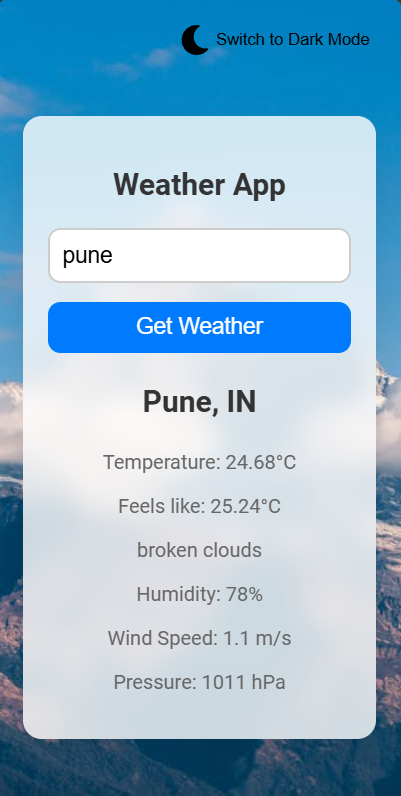
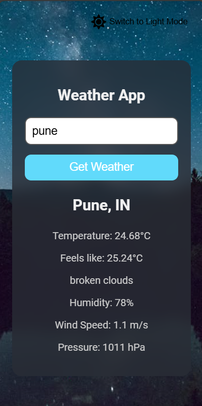
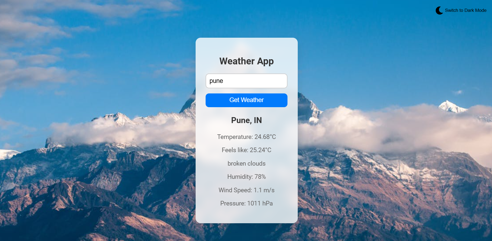

# Weather App

A simple and responsive weather application built with React. The app allows users to search for weather information based on city names and supports light and dark modes for a better user experience.

## Features

- **Search Weather**: Enter a city name to fetch current weather data.
- **Light/Dark Mode**: Toggle between light and dark themes for better visibility.
- **Responsive Design**: The app is fully responsive and works on various screen sizes.

## Technologies Used

- React
- Axios (for API calls)
- OpenWeatherMap API (for weather data)
- CSS (with custom variables for theme management)

## Getting Started

### Prerequisites

- Node.js installed on your machine.
- A code editor (like Visual Studio Code).

### Installation

1. Clone the repository:

   ```bash
   git clone https://github.com/yourusername/weather-app.git
   ```

2. Navigate to the project directory:

   ```bash
   cd weather-app
   ```

3. Install the required dependencies:

   ```bash
   npm install
   ```

4. Create a `.env` file in the root directory and add your OpenWeatherMap API key:

   ```bash
   REACT_APP_WEATHER_API_KEY=your_api_key_here
   ```

5. Start the development server:

   ```bash
   npm start
   ```

6. Open your browser and go to `http://localhost:3000`.

## Usage

1. Enter the name of a city in the input field and click the "Get Weather" button.
2. The app will display the current weather information, including temperature, humidity, and more.
3. Use the toggle button in the top right corner to switch between light and dark modes.

## Screenshots




## Contribution

If you want to contribute to this project, feel free to fork the repository and submit a pull request. All contributions are welcome!

## License

This project is licensed under the MIT License - see the [LICENSE](LICENSE) file for details.

## Acknowledgments

- [OpenWeatherMap](https://openweathermap.org/) for providing the weather API.
- [React](https://reactjs.org/) for building the user interface.
- [Font Awesome](https://fontawesome.com/) for the weather icons.